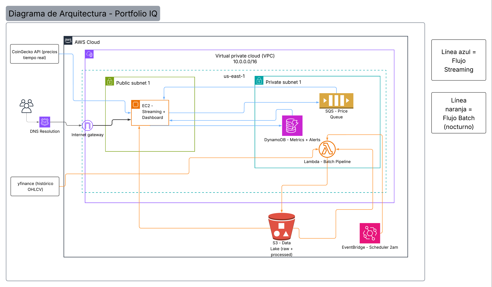

# PortfolioIQ — Financial Portfolio Intelligence Pipeline

Sistema de procesamiento de datos financieros en batch y streaming desplegado completamente en AWS. Monitorea un portafolio de criptomonedas en tiempo real y evalua estrategias de inversion mediante backtesting sobre datos historicos.

## Dashboard en vivo
http://34.228.25.190:8501

## Arquitectura



El sistema implementa el patron Lambda Architecture con dos pipelines:

- **Streaming (ETL):** CoinGecko API → SQS → EC2 Consumer → DynamoDB → Dashboard
- **Batch (ELT):** EventBridge → Lambda → yfinance → S3 raw → Backtesting → S3 processed → Dashboard

## Stack Tecnologico

### AWS
| Servicio | Uso |
|---|---|
| Amazon S3 | Data lake: historicos raw y resultados batch |
| Amazon SQS | Buffer desacoplador entre producer y consumer |
| Amazon DynamoDB | Metricas de portafolio en tiempo real |
| AWS Lambda | Ejecucion del pipeline batch nocturno |
| Amazon EC2 | Streaming 24/7 y dashboard |
| Amazon EventBridge | Scheduler nocturno (2am Colombia) |
| AWS IAM | Gestion de permisos y roles |

### Python
- boto3, yfinance, pandas, numpy, requests, streamlit, plotly

## Estructura del Proyecto

portfolio-iq/
├── batch/
│   ├── data_ingestion.py       # Extract + Load: descarga historicos a S3
│   ├── backtesting.py          # Transform: evalua estrategias de inversion
│   └── run_batch_pipeline.py   # Orquesta ingesta + backtesting
├── streaming/
│   ├── producer.py             # Extract + Transform: CoinGecko → SQS
│   └── consumer.py             # Transform + Load: SQS → DynamoDB
├── dashboard/
│   └── app.py                  # Serving layer: visualiza streaming + batch
├── lambda_batch/
│   └── lambda_handler.py       # Handler Lambda para el batch en AWS
├── infrastructure/
│   ├── setup_aws.md            # Comandos AWS CLI para reproducir la infraestructura
│   └── systemd/                # Servicios systemd para EC2
└── docs/
└── arquitectura.png        # Diagrama de arquitectura

## Pipelines

### Pipeline Streaming (ETL)
1. **Extract:** producer.py hace poll a CoinGecko cada 15s y extrae precios de BTC, ETH, SOL
2. **Transform:** Estandariza estructura, convierte tipos, calcula timestamp
3. **Load:** Publica en SQS → consumer calcula P&L, volatilidad rolling, evalua alertas → persiste en DynamoDB

### Pipeline Batch (ELT)
1. **Extract:** Lambda descarga 2 anos de datos OHLCV via yfinance
2. **Load:** Sube datos crudos a S3 raw/ sin transformacion
3. **Transform:** Backtesting engine lee desde S3, ejecuta 4 estrategias con metodologia correcta (shift(1) para evitar look-ahead bias), calcula metricas

## Estrategias de Backtesting
- **Buy & Hold:** Baseline, compra y mantiene
- **Momentum SMA-20:** Invertido cuando precio > SMA de 20 dias
- **Momentum SMA-50:** Invertido cuando precio > SMA de 50 dias
- **Mean Reversion:** Compra cuando Z-score < -1.5

## Metricas Calculadas
- Sharpe Ratio (retorno ajustado por riesgo)
- CAGR (tasa de crecimiento anual compuesta)
- Max Drawdown (peor caida desde un pico)
- Win Rate (porcentaje de dias positivos)

## Instalacion Local

```bash
pip install boto3 yfinance pandas numpy requests streamlit plotly
aws configure  # Configurar credenciales AWS
python batch/data_ingestion.py
python batch/backtesting.py
python streaming/producer.py
python streaming/consumer.py
streamlit run dashboard/app.py
```

## Infraestructura AWS

Ver [infrastructure/setup_aws.md](infrastructure/setup_aws.md) para los comandos completos de despliegue.

## Automatizacion Nocturna

EventBridge dispara la Lambda cada noche a las 2am Colombia (7am UTC):

cron(0 7 * * ? *)

## Autor
Thomas Buitrago — Universidad EAFIT — Sistemas Intensivos en Datos — Mayo 2026